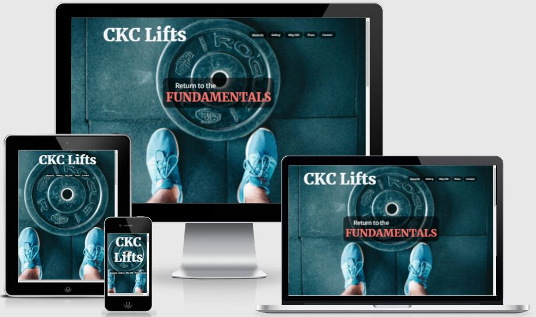
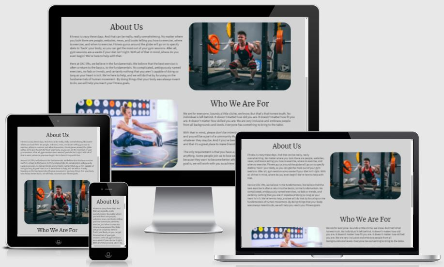
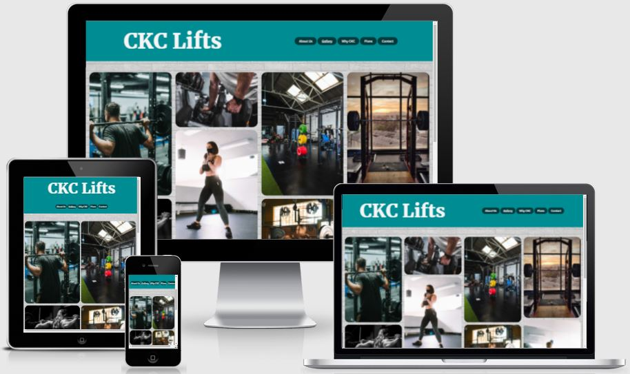
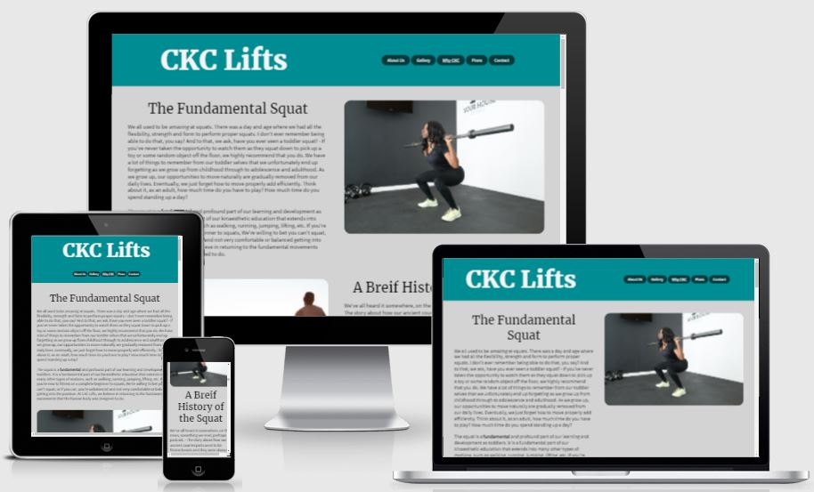
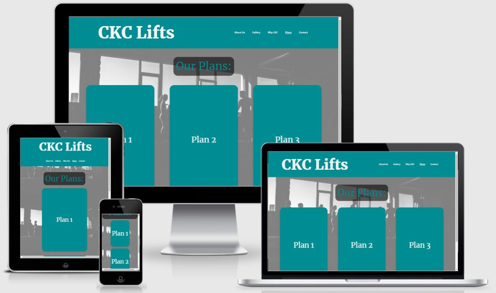
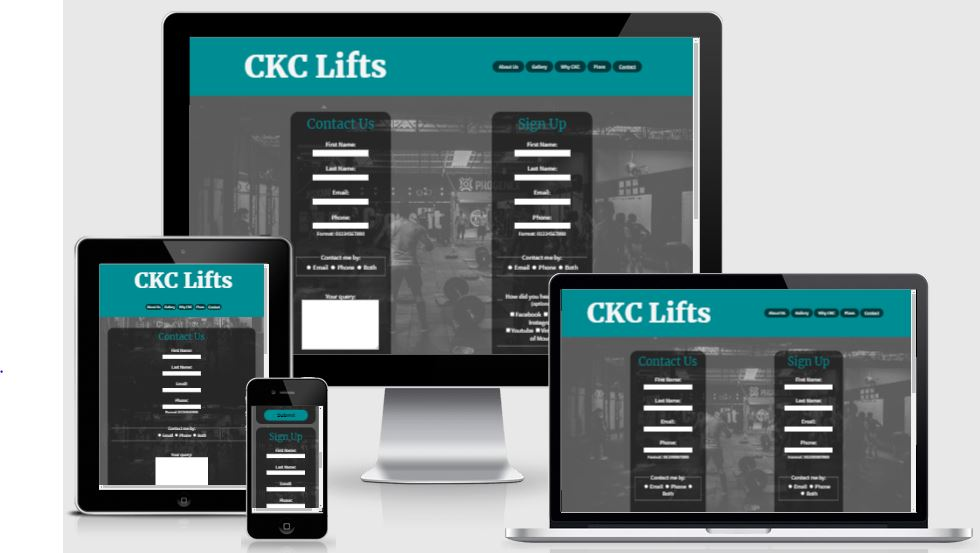
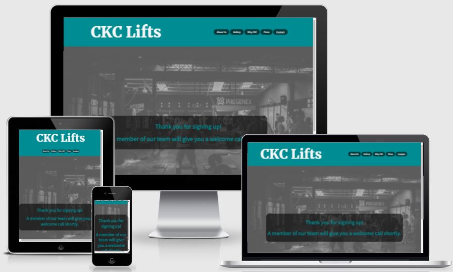
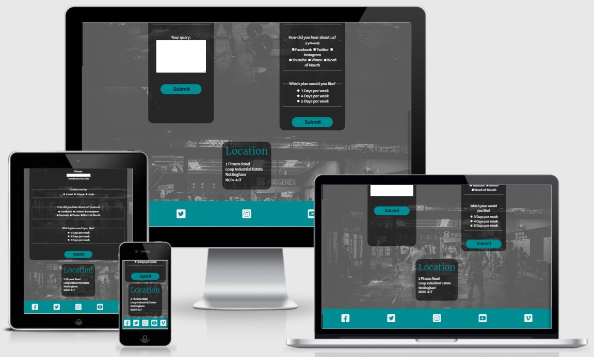

# CKC Lifts
### By Alejandro Spara Dominguez

## [Click here to view the site](https://alexsd92.github.io/ckc_lifts/)

## [Click here to view the repository](https://github.com/AlexSD92/laughing-broccoli)
  
# Table of contents
1. [Why](#Why)
2. [UX](#UX)
    1. [Target Audience](#Target-Audience)
    2. [User Stories](#User-Stories)
    3. [Strategy](#Strategy)
    4. [Scope](#Scope)
    5. [Structure](#Structure)
    6. [Skeleton](#Skeleton)
        1. [Wireframes](#Wireframes)
    7. [Surface](#Surface)
        1. [Colors](#Colors)
        2. [Typography](#Typography)
        3. [Images & Icons](#Images-and-Icons)
3. [Features](#Features)
    1. [Current Features](#Current-Features)
    2. [Future Features](#Future-Features)
4. [Technologies](#Technologies)
5. [Testing](#Testing)
    1. [Tests](#Tests)
    2. [Bugs & Fixes](#Bugs-and-Fixes)
6. [Deployment](#Deployment)
    1. [GitHub Pages](#GitHub-Pages)
    2. [Forking the Repository](#Forking-Repository)
    3. [Cloning the Project Locally](#Cloning-the-Project-Locally)
7. [Credits](#Credits)

# Why

CKC Lifts is an informative website where the user can learn about how to perform a squat and also join the gym. Within the navbar, the user can click on 'Gallery' to view images of the gym, 'CKC Lifts' to learn more about squats, a CKC exercise, 'Plans' to learn more about the membership, and 'Contact' to complete a contact us or sign up form. 

# UX

## Target Audience

- People who are new to fitness. 
- People who are looking for simple and straightforward information regarding squats.
- People who are looking for simple but effective exercise. 
- People who exercise regularly but are looking for a new challenge.
- Athletes that want to improve their performance. 
- Serious lifters that are passionate about fundamental and closed kinetic chain lifts.

## User Stories

### First Time User: 

- As a user, I would like to learn more about CKC Lifts because I am looking to join a gym.
- As a user, I would like to view images of CKC's gym. 
- As a user, I would like to know how much it costs to join your gym and what plans you have available.
- As a user, I like what I have seen on your site, but would like more information.
- As a user, I like what I have seen on your site, and would like to be able to sign up.

### Returning User: 

- I started out on the beginner plan and would like to move to intermediate.
- I started out on the intermediate plan and would like to move to advanced.
- I have a question about your gym after looking at your site.
- I read the information your site had on squats and would like to view some images of your gym.

### As the Website Creator

- I want to make the site visually appealing and engaging. 
- I want the site to be easy to navigate and straightforward.
- I want users to engage with the site and use the contact and sign up forms.

## Strategy

Use a consistent color scheme, spacing and fonts. Add relevant, interesting and easy to understand content. Include visually appealing, consistent images that are high quality. 

### Project Goals

- Create a website that is visually appealing. 
- Create a website that is engaging.
- Ensure the website is easy to navigate. 
- Create a website that users would like to return to.

## Scope

The first release will include:

 - A landing page detailing who CKC Lifts are and who it is for.
 - An image gallery showing images of the gym.
 - An information section with images talking about squats and how to perform them.
 - A plan/membership section where users can view the plans on flip cards, what experience level they are for, and how much the monthly memberships are.
 - A header containing a consistent logo and navigation bar that are responsive. 
 - A footer containing consistent favicons that will hyperlink users to social media on a new tab. 
 - Functioning internal links.
 - High quality, resolved images.

 Features for future release:

- A testimonial page. 
- A discussion page.
- A live board detailing the time and location of our community socials.

## Structure

The structure is intended to be minimalistic so that users can interact with an engaging, but easy to use website. The design will be consistent across all pages apart from the landing page where the header will include a background image. If the user has previous experience navigating websites, they will be able to navigate this site. 

### Header 

- The header will include both a logo and navigation bar.
- The logo will also act as a link back to the home page / landing page.
- The landing page header will also include a background image for a more interesting visual experience.

### About Us Page

- Images and text under grid display.
- Details about the gym, why a user should join us and who the target audience is.

### Gallery Page

- The gallery will contain images for the CKC Lifts gym.
- The gallery will be responsive and images will be grouped into columns and stack on top of one another to create a gallery effect.
- Images will be high quality and optimised.

### CKC Lifts Page

- Will be the information point for users where they can find information about squats, such as history, benefits, etc. 
- Images that will be high quality and optimised. 
- Videos included as iframes detailing how to squat and squat variations.
- Displayed as a grid.

### Plans Page

- Membership and pricing page.
- Information displayed on 3 flip cards. 
- Front of the flip cards says the plan number.
- Back of the flip cards details whether the plan is beginner, intermediate or advanced as well as the monthly pricing.

### Contact Page

- Contains 2 html forms, one contact form and another sign up form. 
- All fields are required apart from checkboxes, which are noted as optional.
- After submitting, the user is forwarded to a thank you page where they are made aware someone will be in touch.
- Displayed as a grid.

### Thank You Pages

- Thanks the user for contacting us or for wanting to sign up.
- Informs the user that someone will be in contact shortly to discuss.

### Footer

- Contains favicons that hyperlink to social media in a new tab.

## Skeleton

### Wireframes

Wireframes for the site can be viewed below:

Desktop:

#### Why CKC

#### Gallery

#### Form

Mobile: 

#### Why CKC

#### Gallery

#### Form

#### Pricing

## Surface

### Colors

The colors that are used for the site are shown below. [Colorhunt](https://colorhunt.co/palette/008c93ff736cd3d3d3f5f5f5) was used to generate a color pallet. 

- 008C93, used for header and footer backgrounds, and some headings
- FF736C, used for tagline color
- D3D3D3, used for body background color
- F5F5F5, used as contrast color for text in logo, navbar, fontawesome, and where appropriate

### Typography

Considering the goal of the site is to be informative, two fonts were picked. 

The original fonts used were Anton and Open Sans.

1. [Anton](https://fonts.google.com/specimen/Anton?query=anton)
2. [Open Sans](https://fonts.google.com/specimen/Open+Sans?query=open+sans)

However, it was later decided to use Merriweather and Source Sans Pro for the headings and paragraphs, respectively.

1. [Merriweather](https://fonts.google.com/specimen/Merriweather?query=merr)
2. [Source Sans Pro](https://fonts.google.com/specimen/Source+Sans+Pro?query=Source+sans+pro)

### Images and Icons

[Fontawesome](https://fontawesome.com/) icons were used for the footer of the site to direct users to social media pages. 

Only stock images were used for the design of the site from [Unsplash](https://unsplash.com/images/stock)

All original image links below:

1. https://unsplash.com/photos/7Li2duPduew 
2. https://unsplash.com/photos/3qZt1MwF4Zo 
3. https://unsplash.com/photos/TuzrzArccvc 
4. https://unsplash.com/photos/ZW_TNzH1KiA 
5. https://unsplash.com/photos/UDOpbhxNNU4 
6. https://unsplash.com/photos/saHd7qc-AMk
7. https://unsplash.com/photos/g_1skq9Gl8o
8. https://unsplash.com/photos/PCxkBX24sWo
9. https://unsplash.com/photos/9MR78HGoflw
10. https://unsplash.com/photos/gNzqerPFtWs
11. https://unsplash.com/photos/2e4lbLTqPIo
12. https://unsplash.com/photos/U2q73PfHFpM
13. https://unsplash.com/photos/VB5i6ZmXUoI
14. https://unsplash.com/photos/gilCd9_Jjv0
15. https://unsplash.com/photos/mFPJXEQfb9M
16. https://unsplash.com/photos/Pnm-9vBEQhk
17. https://unsplash.com/photos/FodEsaNZs48
18. https://unsplash.com/photos/t4DuoDHjxrQ
19. https://unsplash.com/photos/WvDYdXDzkhs
20. https://unsplash.com/photos/FP7cfYPPUKM
21. https://unsplash.com/photos/jO6vBWX9h9Y

All edited images can be found [here](https://github.com/AlexSD92/ckc_lifts/tree/main/assets/images).

All images were optimised using [Gimp](https://www.gimp.org/) version 2.10.28.

# Features

## Current Features

 - A landing page detailing who CKC Lifts are and who it is for.
 - An image gallery showing images of the gym.
 - An information section with images talking about squats and how to perform them.
 - Embedded videos demonstrating how to squat and squat varieties. 
 - A plan/membership section where users can view the plans on flip cards, what experience level they are for, and how much the monthly memberships are.
 - A contact page with an option between a contact form and sign up form.
 - A header containing a consistent logo and navigation bar that are responsive. 
 - A footer containing consistent favicons that will hyperlink users to social media on a new tab. 
 - Functioning internal links.
 - High quality, resolved images.

## Future Features

- A testimonial page. 
- A discussions page.
- A live board detailing the time and location of our community socials.

# Technologies

## Languages

- [HTML5](https://en.wikipedia.org/wiki/HTML5)
- [CSS3](https://en.wikipedia.org/wiki/CSS)

## Other Technologies, Frameworks & Libraries

- [Google Fonts](https://fonts.google.com/)
    - Used for importing fonts, allowing for the fonts to be available for all users.
- [Font Awesome](https://fontawesome.com/)
    - Font Awesome provides all the icons used for the site.
- [Git & GitBash](https://gitforwindows.org/)
    - Git for Windows provides a BASH emulation which allows for git to be used straight from the command line.
- [GitHub](https://github.com/)
    - Provided a Remote repository for the application. Allowing for my coding to be backed up online as I go.
- [Gitpod](https://gitpod.io/)
    - Development environment used to develop the code for this project.
- [Colorhunt](https://colorhunt.co/)
    - To select a color pallet for site design.
- [Gimp](https://www.gimp.org/)
    - To optimise images for the site. 
- [Wire Flow Wireframe Design](https://play.google.com/store/apps/details?id=com.ludomade.blueprint&hl=en_GB&gl=US)
    - To create the wireframes for this site. 

# Testing

## Tests

### [HTML Validator](https://validator.w3.org/)

All HTML pages have been tested with the w3c validator and have passed with no errors.

There were some warnings regarding redundant alt="" text for the images, but it was not applicable to the text included.

### [Jigsaw CSS Validator](https://jigsaw.w3.org/css-validator/)

CSS code passed through the validator with no errors.

### Testing Against User Stories

- First Time User: 

1. As a user, I would like to learn more about CKC lifts because I am looking to join a gym.
    - User arrives at the 'About Us' home/landing page and scrolls down to find more information about CKC Lifts, who the target audience is, and what else they can find on the site. The user seeks more information and accesses 'Why CKC', 'Plans', or 'Contact', for more information.
2. As a user, I would like to view images of CKC's gym. 
    - User arrives at the home page and clicks 'Gallery' on the navigation bar. On 'Gallery' the user is able to view member and equipment images of CKC Lifts.
3. As a user, I would like to know how much it costs to join your gym and what plans you have available.
    - User arrives at the home page and clicks 'Plans' on the navigation bar. On 'Plans, user can clearly see 'Our Plans:' followed by 3 plan cards. User hovers over plan cards and can view concise information on what plans are available.
4. As a user, I like what I have seen on your site, but would like more information. 
    - User arrives at the home page and clicks 'Contact'. On contact, user can complete the 'Contact Us' form with their query. User completes the form and is forwarded to a 'Thank You' page where it is acknowledged they have successfully submitted the form and that a member of CKC Lifts will be in contact to answer their query.
5. As a user, I like what I have seen on your site, and would like to be able to sign up.
    - User arrives at the home page and clicks 'Contact'. On contact, user can comlete the 'Sign Up' form and select which plan they would like to sign up to. User completes the form and is forwarded to a 'Thank You' page where it is acknowledged that they have succesfully sumbitted the form and that a member of CKC Lifts will be in contact to answer their query.

- Returning User: 

1. I started out on the beginner plan and would like to move to intermediate. 
    - User arrives at the home page and clicks 'Contact'. On contact, user can comlete the 'Sign Up' form and select which plan they would like to sign up to. User completes the form and is forwarded to a 'Thank You' page where it is acknowledged that they have succesfully sumbitted the form and that a member of CKC Lifts will be in contact to answer their query.
2. I started out on the intermediate plan and would like to move to advanced. 
    - User arrives at the home page and clicks 'Contact'. On contact, user can comlete the 'Sign Up' form and select which plan they would like to sign up to. User completes the form and is forwarded to a 'Thank You' page where it is acknowledged that they have succesfully sumbitted the form and that a member of CKC Lifts will be in contact to answer their query.
3. I have a question about your gym after looking at your site. 
    - User arrives at the home page and clicks 'Contact'. On contact, user can complete the 'Contact Us' form with their query. User completes the form and is forwarded to a 'Thank You' page where it is acknowledged they have successfully submitted the form and that a member of CKC Lifts will be in contact to answer their query.
4. I read the information your site had on squats and would like to view some images of your gym.
    - User arrives at the home page and clicks 'Gallery' on the navigation bar. On 'Gallery' user is able to view member and equipment images of CKC Lifts.

# Bugs and Fixes

No bugs were found at the time of submission.

# Deployment

## GitHub Pages

The code for this site has been deployed via GitHub pages. This was done at the very start of the project in order to be able to test across multiple devices and view a live version of the site throughout all stages of development. 

In order to deploy on GitHub pages, you must: 

1. Create a GitHub account (if you have one already, skip this step).
2. Navigate to the [repository](https://github.com/AlexSD92/laughing-broccoli#GitHub-Pages). 
3. Access the 'Settings' at the top right of the repository. 
4. On the navigation menu on the left, click on 'Pages'. 
5. On the 'Source' tab, ensure the dropdown that is selected is 'None'. 
6. Select the 'main' branch, this may be called 'master'.
7. Save.
8. A URL will be generated for your site. 
9. Process complete. 

## Getting Started

If you would like to copy my development environment for this project, do the following: 

1. Create a GitHub account. 
2. Download Gitpod extension (you can log in using GitHub). 
3. Once the Gitpod extension is installed, refresh GitHub. 
4. Create a new repository, name it and give it a description. 
5. Choose whether you want for the repository to be private or public. 
6. Select to add a README file, as well as .gitignore. 
7. Determine if you want a license. 
8. Click 'Create Repository'.
9. Click the green 'Gitpod' button to launch the development environment.
10. Happy coding.

## Forking Repository

In order to make changes to this code without affecting the original code, you must fork the repository. This means that you will be given a copy of the code for that moment in time. In order to do ths, you must: 

1. Create a GitHub account (if you have one already, skip this step).
2. Navigate to the [repository](https://github.com/AlexSD92/laughing-broccoli#GitHub-Pages). 
3. Near the top right, click 'Fork'. 
4. A copy of the repository will be available for you to use within your own remote repositories. 

## Cloning the Project Using Gitpod

1. Create a GitHub account (if you have one already, skip this step).
2. Navigate to the [repository](https://github.com/AlexSD92/laughing-broccoli#GitHub-Pages) you would like to clone. 
3. Near the top, select 'Code' in the dropdown. 
4. Copy the HTTPS address.
5. Open Gitpod.
6. Navigate to the directory where you would like to create a new directory using the terminal. 
    - Use the pwd command to know where you currently are. 
    - Use cd followed by the directory name to change directories. 
    - use mkdir followed by a new directory name to create a new directory.
7. Create a new directory (mkdir) named 'CKC Lifts'.
8. Change directory (cd) in to 'CKC Lifts'.
9. Enter 'git clone [insert HTTPS address here]'.
10. GitBash will clone the 'CKC Lifts' repository in to your chosen directory.

## Cloning the Project Locally

1. Create a GitHub account (if you have one already, skip this step).
2. Navigate to the [repository](https://github.com/AlexSD92/laughing-broccoli#GitHub-Pages) you would like to clone. 
3. Near the top, select 'Code' in the dropdown. 
4. Copy the HTTPS address.
5. Download and open open [GitBash](https://gitforwindows.org/) terminal.
6. Navigate to the directory where you would like to create a new directory. 
    - Use the pwd command to know where you currently are. 
    - Use cd followed by the directory name to change directories. 
    - use mkdir followed by a new directory name to create a new directory.
7. Create a new directory (mkdir) named 'CKC Lifts'.
8. Change directory (cd) into 'CKC Lifts'.
9. Enter 'git clone [insert HTTPS address here]'.
10. GitBash will clone the 'CKC Lifts' repository in to your chosen local directory.
11. Open the repository using your preferred IDE, such as [Atom](https://atom.io/), [Visual Studio](https://code.visualstudio.com/), etc.

# Credits

1. [W3Schools](https://www.w3schools.com/)
    - An invaluable resource for this project in terms of documentation and tutorials. 
    - Borrowed code for [flip cards](https://www.w3schools.com/howto/howto_css_flip_card.asp) on pricing.html page. This can also be found commented in style.css.

2. [MDN Web Docs](https://developer.mozilla.org/en-US/)
    - Another fantastic resource for this project in terms of documentation and tutorials. 

3. [Stack Overflow](https://stackoverflow.com/)
    - Amazing forums with great and detailed discussions, not only demonstrating how to write code, but why it should be written that way.

4. [Code Institute](https://codeinstitute.net/)
    - Fantastic learning platform and amazing tutors on slack that are always willing to help.

5. [Squat University](https://www.youtube.com/channel/UCyPYQTT20IgzVw92LDvtClw)
    - Great videos and information on squatting.

6. [Critical Bench](https://www.youtube.com/channel/UC5efErrEnb4krh7dwJdj3RA)
    - Interesting videos on a variety of exercise and exercise varieties. 

7. Chris Quinn, Mentor
    - Excellent resource and a wealth of knowledge and insight. Lessons around CSS grid really added some invaluable knowledge and experience to my project. 

[RETURN TO THE TOP](#CKC-Lifts)

